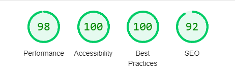

# Royal Match
Royal Match is a simple, yet fun memory game. In this game, you flip over cards two at a time untill you have matched all the pairs. This game is a neat little way to pass time, that is both fun and good for the brain.

# Features

## The game

* The game is the main function of the page. 
* It is easy to understand and most importantly fun
  

## The footer

* The footer provides links to social media to invite friends to play

### Features left to implemet

* A timer to track how fast u can solve the game
* A link to social media to share your time

# Testing
I have tested the site both locally and after deployment, checking that links work, all interactivity is working, and that the website is responsive over multiple screen sizes.

## Validator Testing

* HTML
  - No errors were returned when passing through the official [W3C Validator](https://validator.w3.org/#validate_by_input)

* Css
  - No errors were returned when passing through the official [(Jigsaw) Validator](https://jigsaw.w3.org/css-validator/#validate_by_input)

* Javascript
  - No errors were returned when passing through the [(JShint) Validator](https://jshint.com/), just a few warnings.

* Lighthouse score
  

# Deployment

* The site was deployed to GitHub pages. The steps to deploy are as follows:
  * In the GitHub repository, navigate to the Settings tab
  * From the source section drop-down menu, select the Master Branch
  * Once the master branch has been selected, the page will be automatically refreshed with a detailed ribbon display to indicate the successful deployment.

Live link - [Royal Match](https://justinfourie1993.github.io/Royal-Match/)
  